# Ad-Shield FE

Version: 0.1.0

## Overview

Ad-Shield FE is a frontend application designed to provide network security monitoring and analysis tools. It offers dashboards and utilities for both tenants and super administrators to manage and investigate various network security aspects.

## Key Features

*   **IP Lookup:** Perform IP lookups and view detailed information.
*   **Port Scanning:** Initiate and review port scan reports.
*   **Vulnerability Scanning:** Conduct vulnerability scans and analyze results.
*   **PCAP Analysis:** Analyze packet captures at different network layers (Application, Transport, Network).
*   **Role-Based Access:** Separate dashboards and functionalities for Tenants and Super Administrators.
*   **Statistical Views:** Super Admins can view statistics related to users, roles, and system activities.
*   **Client Monitoring (Super Admin):** Super Admins can oversee client-specific PCAP analysis and port scans.

## Screenshots

Below are some screenshots showcasing the application's interface and features.

### Tenant Views

**IP Lookup Table**
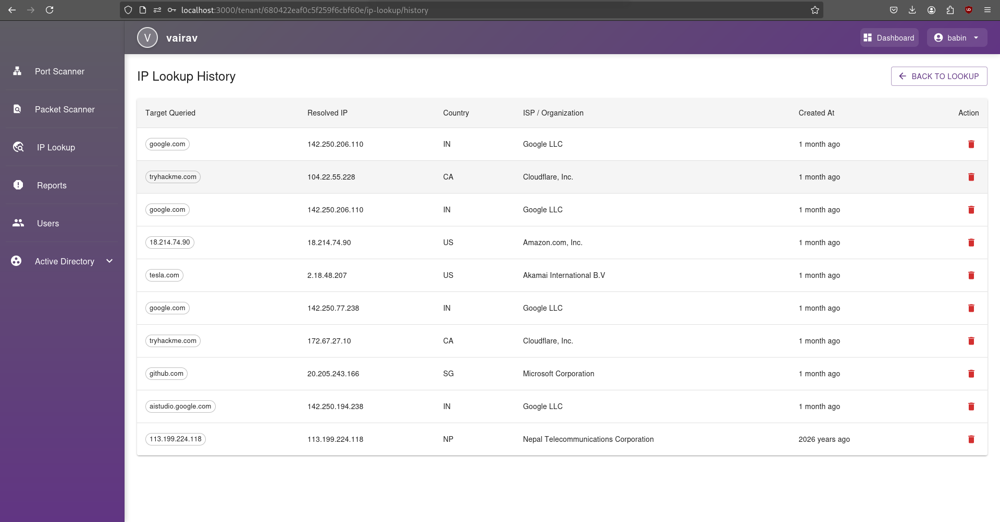
*Displays a tabular view of IP lookup results for the tenant.*

**IP Lookup Detail**
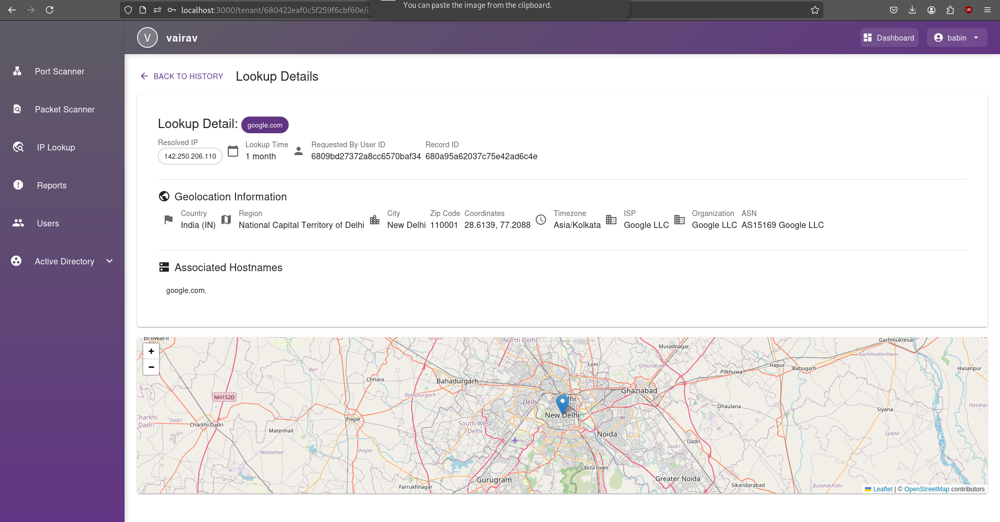
*Shows detailed information for a specific IP address lookup by the tenant.*

**Port Scanning Page**
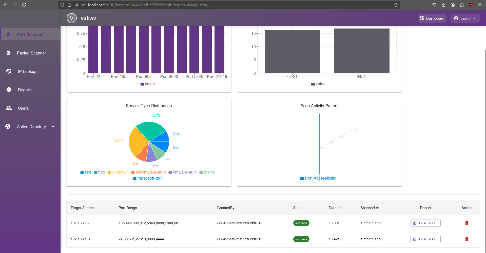
*The main interface for tenants to initiate and manage port scans.*

**Port Scan Detail Page**
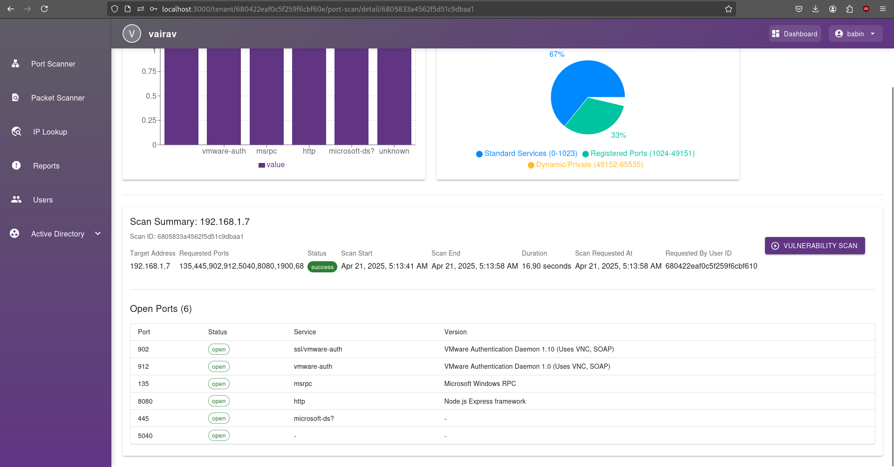
*Detailed view of a specific port scan executed by the tenant.*

**Port Scan Report**
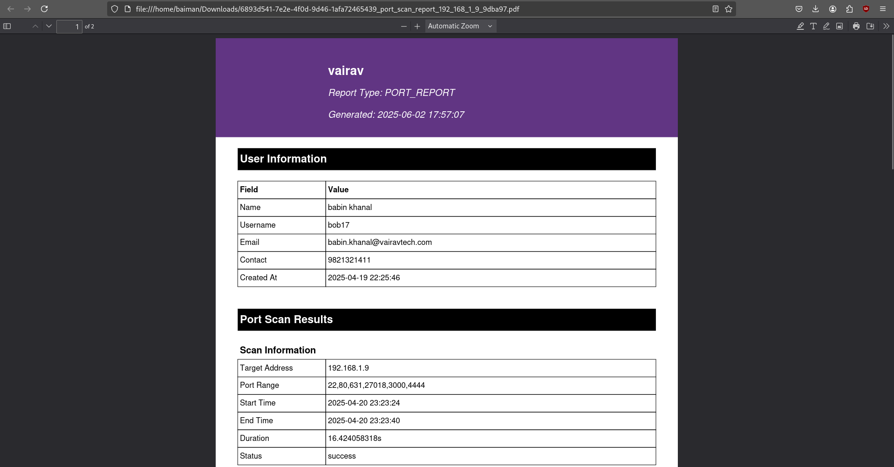
*Presents a comprehensive report of a completed port scan for the tenant.*

**Vulnerability Scanner (Blank State)**
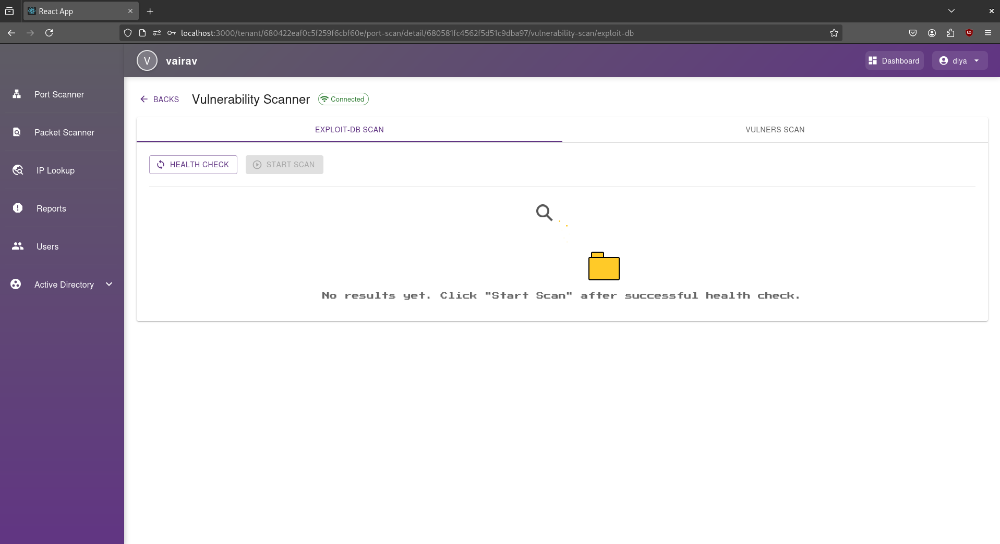
*The initial state of the tenant's vulnerability scanner interface before a scan is performed.*

**Vulnerability Scanning Results**
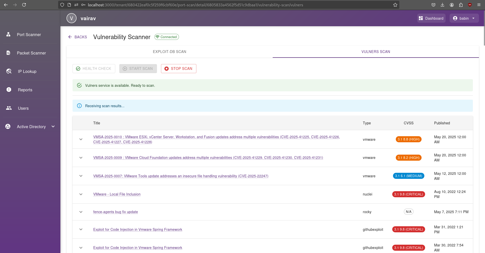
*Displays the results of a vulnerability scan performed by the tenant.*

**PCAP Analysis: Application Layer**
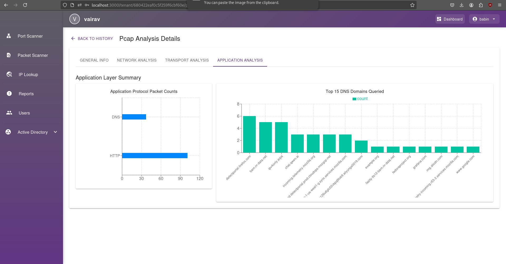
*Tenant view of PCAP analysis focusing on the application layer.*

**PCAP Analysis: Transport Layer**
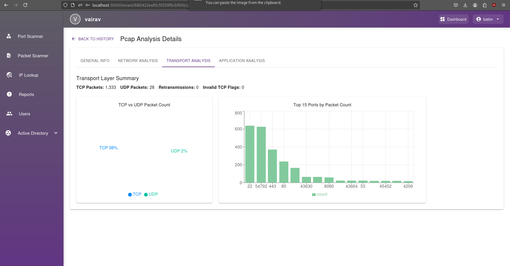
*Tenant view of PCAP analysis focusing on the transport layer.*

**PCAP Analysis: Network Layer**
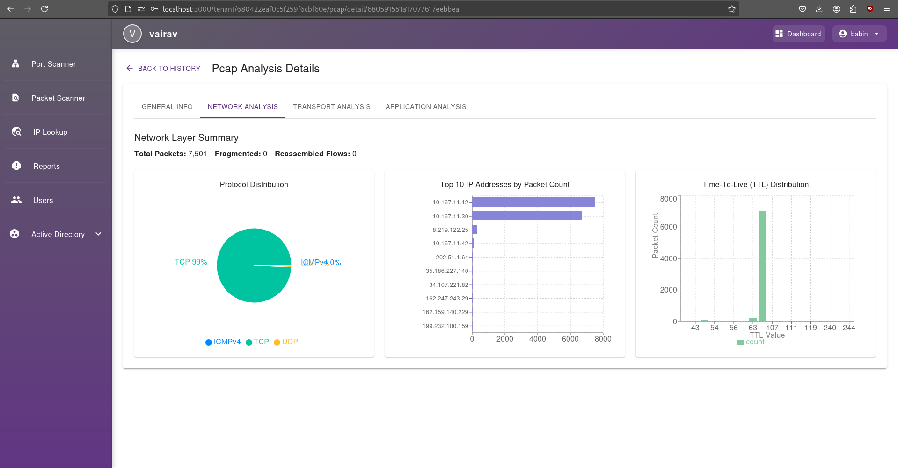
*Tenant view of PCAP analysis focusing on the network layer.*

### Super Admin Views

**Super Admin Dashboard**
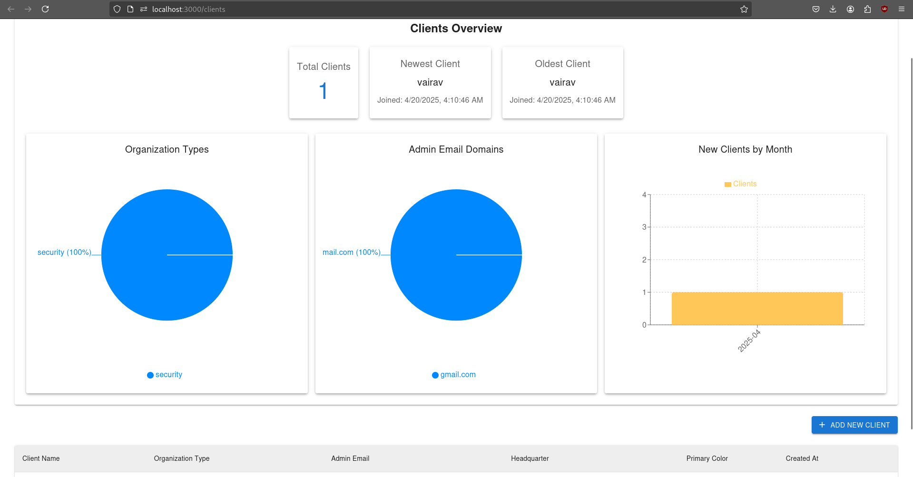
*The main dashboard for Super Administrators, providing an overview of the system.*

**User Statistics**
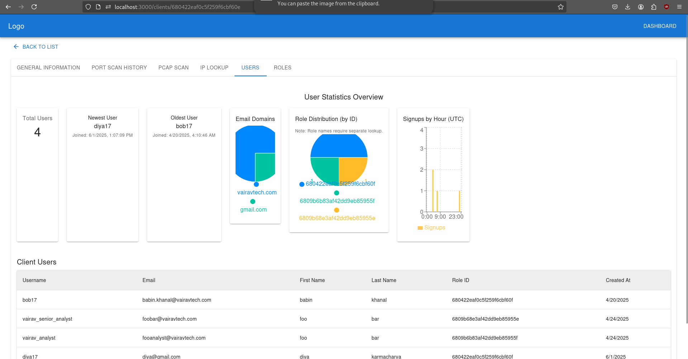
*Super Admin view displaying statistics related to user activity.*

**Role Statistics**
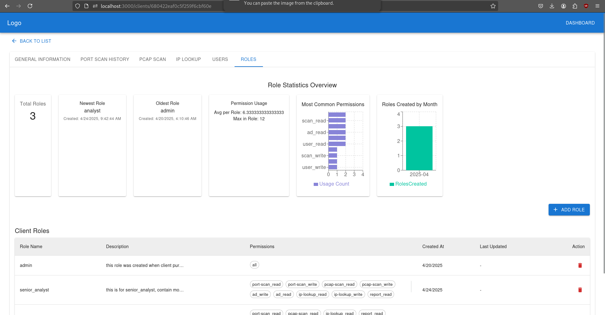
*Super Admin view displaying statistics related to user roles.*

**IP Lookup Monitoring**
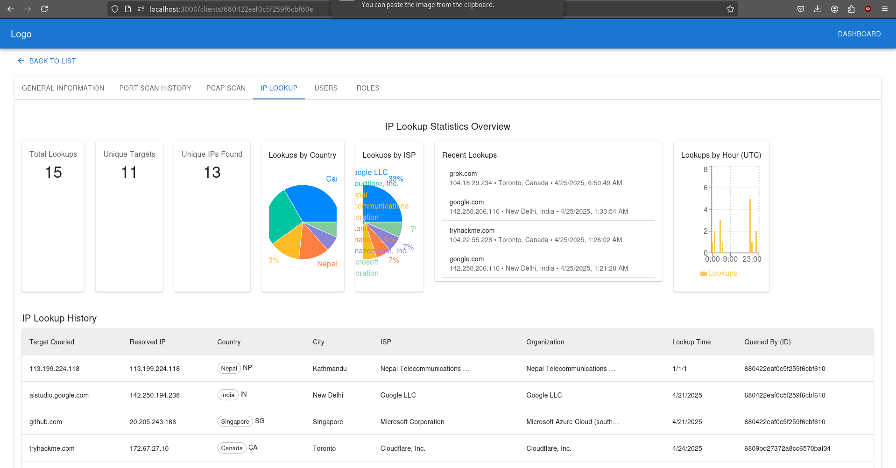
*Super Admin interface for monitoring IP lookup activities.*

**Client PCAP Analysis Overview**
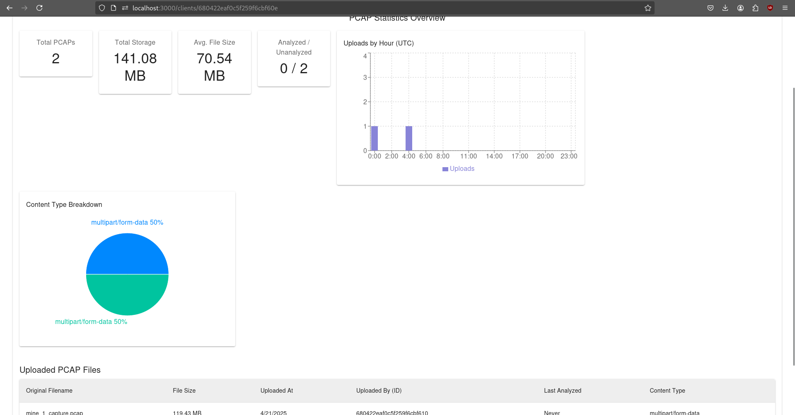
*Super Admin view for overseeing PCAP analysis for clients.*

**Client Port Scan Overview**
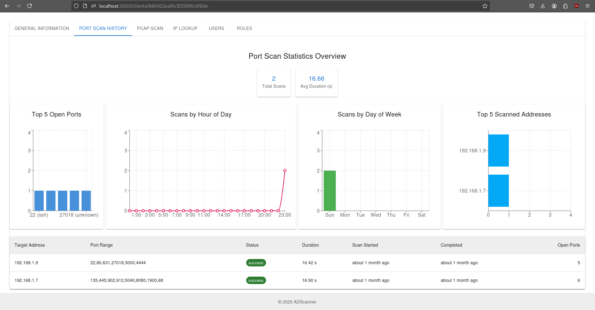
*Super Admin view for overseeing port scanning activities for clients.*

## Technologies Used

*   **React:** JavaScript library for building user interfaces.
*   **Redux Toolkit:** For state management.
*   **Material-UI (MUI):** React component library for faster and easier web development.
*   **React Router:** For declarative routing in React applications.
*   **Axios:** Promise-based HTTP client for the browser and Node.js.
*   **Recharts:** A composable charting library built on React components.
*   **Leaflet & React-Leaflet:** For interactive maps (if used for geolocation features).
*   **Date-fns:** For modern JavaScript date utility functions.
*   **Framer Motion:** For animations.
*   **React Markdown:** To render Markdown content.
*   **React Syntax Highlighter:** For syntax highlighting in code blocks.

## Getting Started

These instructions will get you a copy of the project up and running on your local machine for development and testing purposes.

### Prerequisites

*   Node.js (v14.x or later recommended)
*   npm (comes with Node.js) or yarn

### Installation

1.  Clone the repository (if applicable) or navigate to your project directory.
2.  Install the dependencies:
    ```bash
    npm install
    ```
    or if you use yarn:
    ```bash
    yarn install
    ```

### Running the Project

To start the development server:

```bash
npm start
```

This will run the app in development mode. Open [http://localhost:3000](http://localhost:3000) to view it in your browser. The page will reload when you make changes.

## Available Scripts

In the project directory, you can run:

*   `npm start`: Runs the app in development mode.
*   `npm test`: Launches the test runner in interactive watch mode.
*   `npm run build`: Builds the app for production to the `build` folder.
*   `npm run eject`: Removes the single dependency (react-scripts) and copies all configuration files and transitive dependencies into your project. **Note: this is a one-way operation. Once you `eject`, you can't go back!**

## Contributing

Contributions are welcome! Please follow the standard fork, branch, and pull request workflow. Ensure your code adheres to the project's coding standards.

_(Further details on contributing can be added here, such as specific guidelines or contact information.)_

## License

This project is currently private. 
_(If you intend to make it public, you should add a license file (e.g., MIT, Apache 2.0) and specify it here.)_
